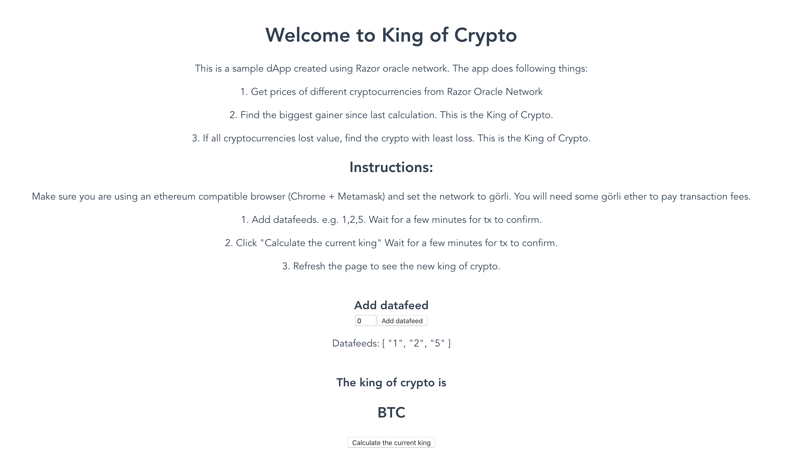

# Tutorial - SKALE
In this tutorial we will explore how to use Razor Oracle network in your applications.
We will create an application called "King of Crypto" using Razor network. The code for this sample app is
available at [https://github.com/razor-network/king-of-crypto](https://github.com/razor-network/king-of-crypto)



## Network
These instructions are for deploying the dApp on SKALE testnet. Please click below if you want to deploy on a different network.

* [Görli](../Görli/)
* [Matic](../Matic/)
## Setting up the Smart Contracts
We will be using truffle to set up, compile and deploy the smart contracts.
Truffle can be installed by

`npm i -g truffle`

`npm i -g truffle-hdwallet-provider`

Create a new directory and type:

`truffle init`

This will setup a new truffle project.

Go to the `contracts` subdirectory and create a new file called `King.sol`

The smart contract has the following functionality:

   1. Get prices of different cryptocurrencies from Razor Oracle Network.

   2. Find the biggest gainer since last calculation. This is the new King of Crypto.

   3. If all cryptocurrencies lost value, find the crypto with least loss. This is the new King of Crypto.

Paste the following code in that file.

```
pragma solidity 0.5.10;

interface Razor {
    function getResult(uint256 id) external view returns (uint256);
    function getJob(uint256 id) external view returns(string memory url, string memory selector, string memory name, bool repeat, uint256 result);
}

contract King {
    Razor public razor;
    uint256[] public jobs;
    uint256 public numJobs = 0;
    uint256 public king = 0;
    uint256[] public lastResults;

    constructor() public {
        razor = Razor(0x3be8b3Ea5Cb7d7D19032A56D3aDF1F0f8e97e34e);
    }

    function addFeed(uint256 jobId) public {
        jobs.push(jobId);
        numJobs = numJobs + 1;
        lastResults.push(0);
    }

    function findKing() public {
        uint256 highestGain = 0;
        uint256 highestGainer = 0;
        uint256 leastLoss = 0;
        uint256 leastLoser = 0;
        for(uint256 i = 0; i < jobs.length; i++) {
            uint256 price = razor.getResult(jobs[i]);
            if(price > lastResults[i]) {
                if(price - lastResults[i] > highestGain) {
                    highestGain = price - lastResults[i];
                    highestGainer = jobs[i];
                }
            } else if(price < lastResults[i]) {
                    if(lastResults[i] - price < leastLoss) {
                        leastLoss = lastResults[i] - price;
                        leastLoser = jobs[i];
                    }
                }

            lastResults[i] = price;
        }
        if (highestGain > 0) {
            king = highestGainer;
        } else if (leastLoss > 0) {
            king = leastLoser;
        }
    }
}
```

Make sure to set the Razor address to `0x3be8b3Ea5Cb7d7D19032A56D3aDF1F0f8e97e34e`

A datafeed can be added to the contract using the `addFeed()` function.

This function requires a "Job ID", also known as the datafeed ID. You can know the available datafeeds and their ID by exploring [https://razorscan.io/#/custom](https://razorscan.io/#/custom)


The instructions to create a new datafeed can be found [Here](../Quick Start/usage.md#create-a-datafeed-query-using-razorscan)

The following line fetches result from Razor Oracle Network for the relevent datafeed Id.

```uint256 price = delegator.getResult(jobs[i]);```

## Set up the migration

Create a new file called 2_deploy.js in the migrations director and paste the following code. This will tell truffle how to deploy the contract on the network.

```

var King = artifacts.require('./King.sol')
module.exports = async function (deployer) {

deployer.then(async () => {
  await deployer.deploy(King)
})
}

```

## Set up the truffle configuration

Use an ethereum wallet such as [MyEtherWallet](https://www.myetherwallet.com/create-wallet) or [MyCrypto](https://download.mycrypto.com/) to create a new wallet with 12-word mnemonic phrase.

Create a new file called `.secret` in the root of the project and paste the above mnemonic phrase. Please fund this account with SKALE testnet ether.

You can set up truffle configuration as it suits you. You can see this file for reference. [truffle-config.js](https://github.com/razor-network/king-of-crypto/blob/master/truffle-config.js)

## Deploy the Contracts
Type the following command to deploy the contracts on SKALE testnet.

`truffle migrate --network skale`

## Setting up the frontend using Vue

We will be using Vue to create a UI for the application. React or any other javascript framework can also be used alternatively.

Vue cli can be installed by

`npm install -g @vue/cli`

In the root of the project, type the following command. Choose default options.

`vue create king`

This will create a new directory `king` with a blank vue project.

You will need `web3.js` in order to interact with the SKALE network. install it typing

`npm i --save web3`

Create a `common.js` file as shown [here](https://github.com/razor-network/king-of-crypto/blob/master/king/src/utils/common.js). Make sure to replace the variable `razorAddress` with `0x3be8b3Ea5Cb7d7D19032A56D3aDF1F0f8e97e34e` and `networkId` with `1`

The `getJob` function in `common.js` shows how to get details of a datafeed in javascript directly from Razor Network Oracle.

Modify the `components/HelloWorld.vue` file as shown [here](https://github.com/razor-network/king-of-crypto/blob/master/king/src/components/HelloWorld.vue)

You can run the dApp by using the following command

``` npm run dev ```

## Instructions for using the dApp
Make sure you are using an ethereum compatible browser (Chrome + Metamask) and set the network to your SKALE endpoint.

1. Add datafeeds. e.g. 1,2,5. Wait for a few minutes for tx to confirm.
2. Click "Calculate the current king" Wait for a few minutes for tx to confirm.
3. Refresh the page to see the new king of crypto.
